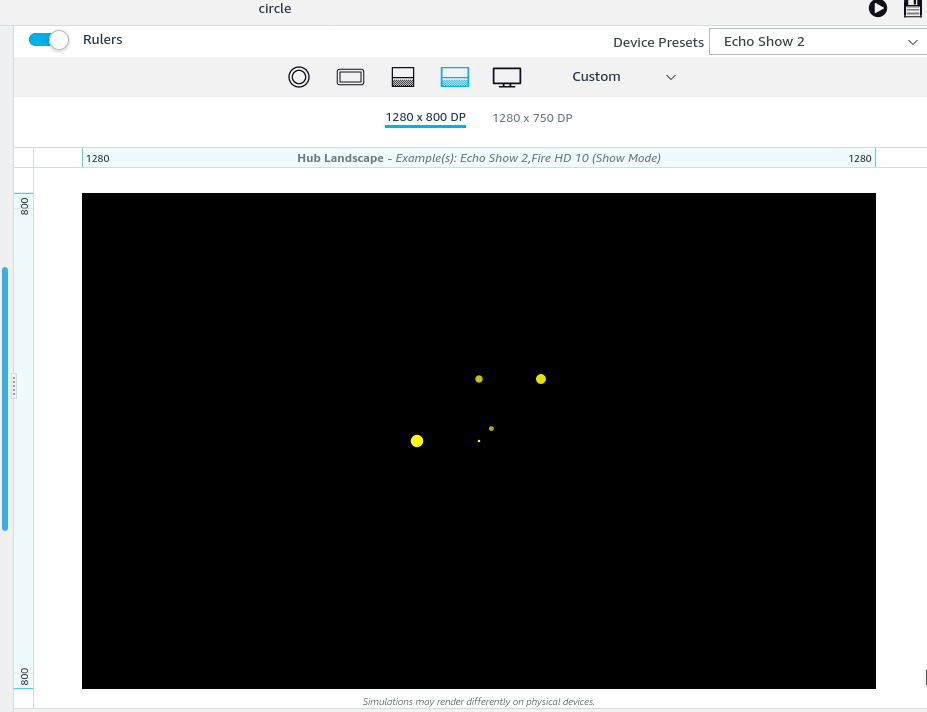
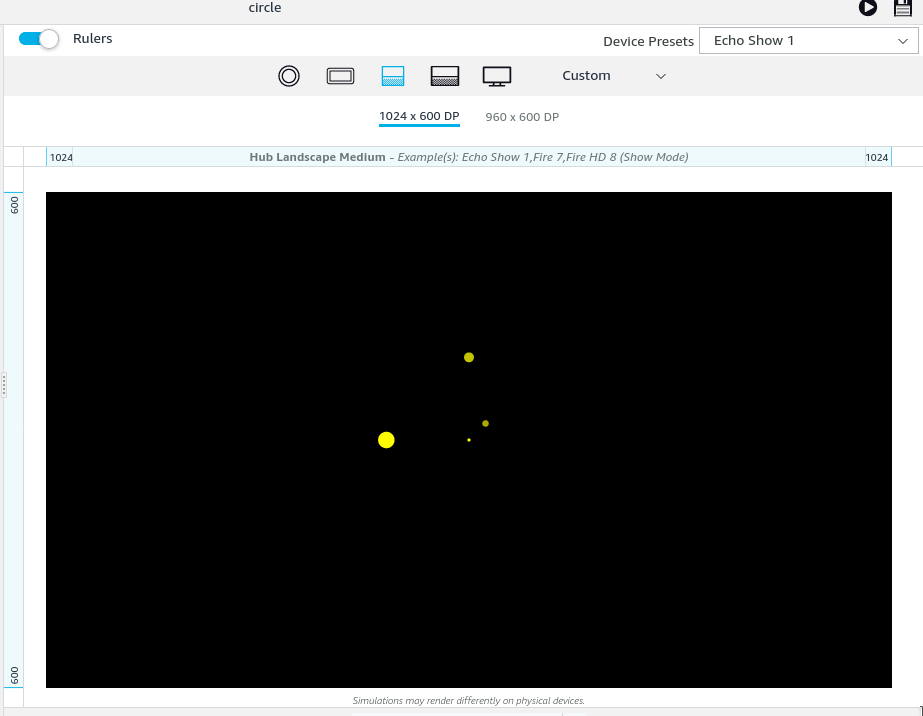
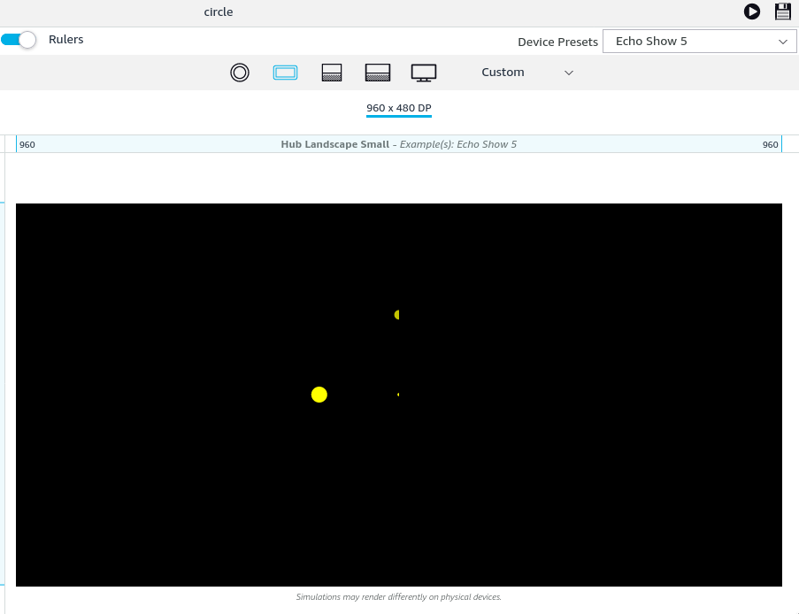

# AVG boundaries
This is a problem I found by playing with APL VectorGraphics. I was trying to work in a component that took up the entire viewport, and create my own coordinate system by translating by `viewport.pixelwidth/2` and `viewport.pixelHeight/2`.  I found different devices cut off the screen at different points.  Probably some definition of the screen boundaries, but I haven't found it yet. You can recreate this issue by either
1) pasting the code from below into the Authoring tool, or
2) load the json code [circle.json](circle.json ) into the Authoring tool

in `graphics` I created a parameterized circle:
```
{
    "circle": {
        "type": "AVG",
        "version": "1.0",
        "height": "100vw",
        "width": "100vh",
        "parameters": [
            {
                "name": "color",
                "type": "color",
                "default": "yellow"
            },
            {
                "name": "radius",
                "type": "number",
                "default": 2
            },
            {
                "name": "x",
                "type": "number",
                "default": 0
            },
            {
                "name": "y",
                "type": "number",
                "default": 0
            }
        ],
        "items": [
            {
                "type": "group",
                "scaleX": 1,
                "scaleY": 1,
                "translateX": "${viewport.pixelWidth/2-radius+x}",
                "translateY": "${viewport.pixelHeight/2-radius-y}",
                "items": [
                    {
                        "type": "path",
                        "pathData": "M0 ${radius} a ${radius} ${radius} 0 1 1 ${radius*2} 0 a ${radius} ${radius} 0 1 1 -${radius*2} 0",
                        "strokeWidth": 0,
                        "fill": "${color}"
                    }
                ]
            }
        ]
    }
}
```

then in `mainTemplate.items` I made a `Container` to hold it and data for 5 circle in different locations with different colors and sizes.
```
{
    "type": "Container",
    "width": "100vw",
    "height": "100vh",
    "items": [
        {
            "type": "VectorGraphic",
            "id": "circles",
            "width": "100%",
            "height": "100%",
            "position": "absolute",
            "source": "circle",
            "color": "${data.color}",
            "radius": "${data.radius}",
            "x": "${data.x}",
            "y": "${data.y}"
        }                ],
    "data": [
        {
            "radius": 2,
            "x": 0,
            "y": 0,
            "color": "yellow"
        },
        {
            "radius": 10,
            "x": -100,
            "y": 0,
            "color": "rgb(255,255,0)"
        },
        {
            "radius": 8,
            "x": 100,
            "y": 100,
            "color": "rgb(225,225,0)"
        },
        {
            "radius": 6,
            "x": 0,
            "y": 100,
            "color": "rgb(195,195,0)"
        },
        {
            "radius": 4,
            "x": 20,
            "y": 20,
            "color": "rgb(170,170,0)"
        }
    ]
}
]
```


It shows up like I expect on the Echo Show2 preset:

and the Hub for the Spot is fine as well.


But the Echo Show1 preset cuts off part of the field, removing 1 circle:



And the Echo Show5 preset cuts off more of the field, removing 2 and a half circles:



The TV preset doesn't work at all, but I figured out that is because the number it generates for `viewport.pixelHeight/2` is wrong and puts it off the screen.  But the numbers for the other presets seem right.
