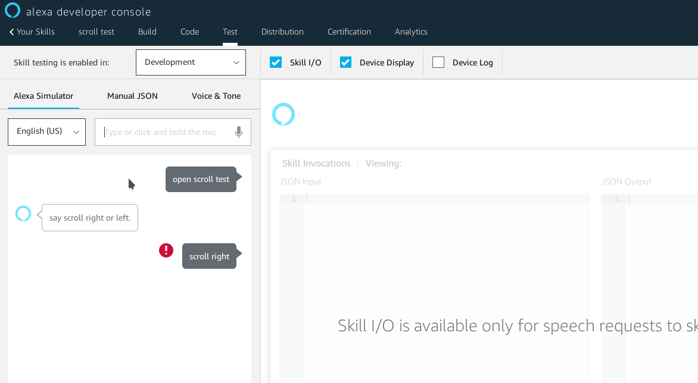

# Scroll response
**Problem**: verbal scrolling doesn't work.


**Reproduce**:
* code to run is in [lambda_function.py](zip/lambda_function.py)
* APL template is directly from Amazon "image forward list sample" except the `componentId` is defined as `scrollSequence` saved here as [apl_selection_template](zip/apl_selection_template)
zip both together and upload to lambda like:
`zip -r scroll.zip * -x scroll.zip`
`aws lambda update-function-code --function-name scroll_test --zip-file fileb://scroll.zip`

* model is in [model.json](model.json) - the key here is to include `AMAZON.ScrollRightIntent` and/or `AMAZON.ScrollLefttIntent` to demonstrate that they aren't activated.

Running this will cause a crash, *before* any IntentRequest is sent. Here is a screenshot from June 28, 2020.


The crash happens if either [min_lambda_function.py](min_lambda_function.py) or [full_lambda_function.py](full_lambda_function.py) are used. The min version just has less distracting code. Full implements everything needed for a skill (except help).

The error message from the device log is:
```
{
    "header": {
        "namespace": "System",
        "name": "Exception",
        "messageId": "0575f16f-cbf5-48e4-a95b-cd3917511f20"
    },
    "payload": {
        "code": "INTERNAL_SERVICE_EXCEPTION",
        "description": "Request could not be executed due to an internal service error."
    }
}
```
